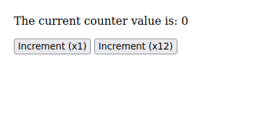

# Mation

is, in short, a web frontend framework

- written in Purescript
- extending [the Elm architecture](https://guide.elm-lang.org/architecture/)<sup>([capture](https://web.archive.org/web/20230607012505/https://guide.elm-lang.org/architecture/))</sup> with...
- ... components (without getting overly complex! no lifetimes, no hooks, no `<slot>`, no messages, etc)
- ... more flexible I/O

(Mation has a bunch of other goodies as well, such as monoidal `Html`, flexible caching, and CSS selectors)


## Why you might like Mation

- You like Elm but think it over-simplifies

  Just as Purescript can be approximated as a more sophisticated version of Elm (the language), adding features like typeclasses and row polymorphism, Mation can be approximated as a more sophisticated version of Elm (the framework), adding features like components and (limited) stateful I/O.

- You like Elm but wish it supported component-based design

  Mation and Elm agree that traditional-style components (ala React, Vue) are overly-powerful. Elm shuns components entirely (see [here](https://guide.elm-lang.org/webapps/structure.html)<sup>([capture](https://web.archive.org/web/20230607011043/https://guide.elm-lang.org/webapps/structure.html))</sup>, section *Components*); Mation on the other hand offers components but limits their power.

- You like React/Vue/Svelte/Halogen/etc but don't like how components have "standalone state", or feel that components are overly-complex.

- You want to use Purescript for front-end web development but don't like existing libraries


## Why you might *not* like Mation

- Your application is particularly performance sensitive or will contain a very large number of DOM nodes

  Mation is fast and has a flexible caching mechanism. However, its core loop is "update and globally rerender", meaning it's likely to fall behind in performance as compared to something with a tighter loop like Svelte. <small>(At the time of writing Mation has not been benchmarked against other frameworks)</small>

- You dislike lenses

  Mation uses lenses to compose components; this provides an extremeley flexible API. However, some people consider lenses a difficult or enigmatic topic, and error messages produced by lenses are generally hard to understand.

- You want something post-1.0 :P


## A Code Sample

Firs,t the result:



Now the source:

```purescript
module Main where
    
import Prelude
import Effect (Effect)
import Data.Foldable (fold)
import Data.Functor.Contravariant (cmap)

import Mation as M
import Mation.Elems as E
import Mation.Props as P
import Mation.Core.Refs as Refs

-- Application state type
type Model = Int

-- Initial state value
initial :: Model
initial = 0

-- Displays the application and defines its behaviour
render :: Model -> E.Html' (M.Modify Model)
render num = fold
  [ E.p
    []
    [ E.text $ "The current counter value is: " <> show num ]
  , E.p
    []
    [ E.button
      [ P.onClick             -- on click,
          \_ ->               -- ignore the click event
            M.modify (_ + 1)  -- increment the model
      ]
      [ E.text "Increment (x1)" ]
    , E.text " "
    , E.button
      [ P.onClick \_event modelRef -> do
            -- An event handler is just an Effect
            -- Within one, you can do whatever you want!
            repeatedly { nTimes: 12, delaySeconds: 0.125 } do
              modelRef # M.modify (_ + 1)
      ]
      [ E.text "Increment (x12)" ]
    ]
  ]

foreign import repeatedly ::
  { nTimes :: Int, delaySeconds :: Number } -> Effect Unit -> Effect Unit

-- Run the app, mounting within <body>
main :: Effect Unit
main = M.runApp
  { initial
  , render: render >>> cmap Refs.downcast
  , root: M.underBody
  , daemon: mempty
  }
```


## More Samples

See `samples/`!


## Acknowledgements

Mation draws a lot of inspiration from Platonic.Systems' [`shpadoinkle`](https://shpadoinkle.org/)<sup>([capture](https://web.archive.org/web/20230607012013/https://shpadoinkle.org/))</sup> and from Mason Mackaman's [`purescript-elmish`](https://github.com/ursi/purescript-elmish)<sup>([capture](https://web.archive.org/web/20230607012734/https://github.com/ursi/purescript-elmish))</sup>. Both of these draw from [Elm](https://elm-lang.org/)<sup>([capture](https://web.archive.org/web/20230607013116/https://elm-lang.org/)).</sup>


## Generated Docs

If you have nix, you can serve the latest docs with

```bash
nix run github:quelklef/mation/main#generated-docs
```

or just build them with

```bash
nix build github:quelklef/mation/main#generated-docs
```
