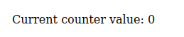
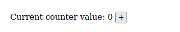
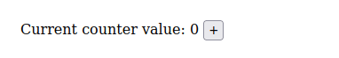

## Architecture

A Mation application consists of three parts:

- A *model*, which holds most of the state of your application
- A *view*, which defines the how the application should
    - be displayed visually
    - react to user interaction
- A *daemon*, which hosts long-running behaviour

We'll see this with the classic example, a counter. (Ours will be somewhat souped-up, though!)

### The Model & The View

The first thing to decide is the *type* for our *model*. This type gives the shape of our application state. Our application is a counter, and a counter state is encapsulated by an integer, so we choose the type `type Model = Int`.

This means that our *model type* is `Int`. Our actual *model* refers to not one value but a series of values of type `Model = Int` which give the state of the application over time.

Now is the view. This consists of a function `render :: forall s. Model -> Html' s` which tells, according to the current model, what to display on-screen. Here `Html'` is the type of HTML output, which Mation will then place onto the webpage. The open variable `s` indicates that our application has no interactivity yet.

```haskell
import Prelude

import Mation (Html')
import Mation.Elems as E

type Model = Int

initial :: Model
initial = 0

render :: forall s. Model -> Html' s
render n =
  E.div
  []
  [ E.text "Current counter value: "
  , E.text (show n)
  ]
```

The `Mation.Elems` module (here called `E`) houses functions for creating `Html'` values; here we use `div` and `text` to output a `<div>` containing two text nodes. (More on this in a bit.)

It's not a full program yet! We still need to actually run it, which requires a new import:

```haskell
import Mation.Run (runApp, underBody)
import Effect (Effect)

main :: Effect Unit
main =
  runApp
    { render
    , initial
    , root: underBody
    , daemon: mempty
    }
```

Here `initial` sets the initial value for the model and `root: underBody` instructs Mation to mount the application as a child of the DOM `<body>`. Ignore `daemon` for now!

If you're following along, your program should compile and the result should look something like this:



And that's great, but I promised that we'd make a *counter* and I don't think this counts as much of a counter if it can't... count.

To make it count we will of course add a button. Like how `<div>` elements are created with `E.div`, `<button>`s are built with `E.button`. This time we also attach a listener, namely to the button `click` event.

```haskell
import Mation.Props as P

render :: Model -> Html' Model
render n =
  E.div
  []
  [ E.text "Current counter value: "
  , E.text (show n)
  , E.text " "
  , E.button
    [ P.onClick \_ update -> update (_ + 1)
    ]
    [ E.text "+"
    ]
  ]
```

To attach the event listener, we've added `P.onClick` to the *first* array given to `E.button`. Almost all exports from `Mation.Elems` are functions which accept two arrays; the first is an array of so-called `Prop'`s and the second is an array of `Html'` children. We've seen `Html'` before; it is a representation of some HTML that can be placed on the DOM. A `Prop'` is an "attribute" for an `Html'`, such as a class name, some CSS, an event listener, a `data-` attribute, so on, so on.

To `P.onClick` we provide a function; this is the event listener. When a `click` event fires, this function is called. As its first argument the listener is given the raw JavaScript `Event` object. As its second argument the listener is given a value called `update`, whose type is essentially:

```
update :: forall s. (s -> s) -> Effect Unit
```

Here `s` can be anything, but for your application to typecheck you should assume that `s = Model`. What this function does is modify your application state: you give it a `Model -> Model`; it will apply that function to the current application model and then re-render, producing an `Effect Unit`.

In our case the function we apply is `(_ + 1) :: Model -> Model`, which increments the current model (which is an `Int`).

Note that we've changed the type of `render`, replacing the open type `s` with the specific type `Model`. This reflects that our application is now interactive and knows how to update a state value of type `Model`.

Anyways, when rendered we do indeed get a counter—thank goodness.



Hey, did you notice? The result of `update` is `Effect Unit`. Our listener is just an `Effect`ful action!

All Mation event listeners are just monadic actions with access to `update`. This means that doing complex things inside an event listener, such as making multiple model updates or doing asynchronous work, is just as easy as working in `Effect`.

To drive this home we have our counter increments last for only a second and then revert. To do this we use JavaScript `setTimeout`:

```haskell
render :: Model -> Html' Model
render n =
  E.div
  []
  [ E.text "Current counter value: "
  , E.text (show n)
  , E.text " "
  , E.button
    [ P.onClick \_ update -> do
          update (_ + 1)
          setTimeout 1000.0 do
            update (_ - 1)
    ]
    [ E.text "+"
    ]
  ]

foreign import setTimeout ::
  Number -> Effect Unit -> Effect Unit
```

```javascript
// Foreign module
export const setTimeout =
ms => f => () => {
  window.setTimeout(f, ms);
};
```




### The Daemon

So what if you wanted to, say, log the value of the counter every second?

Perhaps the first thought is to modify your button event listener to kick off a long-running thread which regularly logs the current `model`. But this won't work! Among other issues, an event listener is able to `update` the model but *not* able to read its current value.

This is intentional! Disallowing event listeners from re-reading the model discourages long-lived event listeners.

Any long-lived processing that an application needs to do is delegated to the *daemon*. A daemon is nothing more than a function with a type like

```haskell
daemon :: WRef Model -> Effect Unit
```

The `WRef Model` given to the `daemon` is a reference to the application model. It supports reading, writing, updating, and a few other very nifty things.

Note that, like an event listener, a `daemon` is just an `Effect`—meaning that performing complex logic in a daemon is just as easy as doing so in `Effect`.

We use the daemon to read the model state and log it. This will require a couple new imports and updating our call to `runApp` to use our `daemon`:

```haskell
import Mation.Core.Util.WRef (Wref)
import Mation.Core.Util.WRef as WRef
import Effect.Console (log)

daemon :: WRef Model -> Effect Unit
daemon wref = do
  setInterval 500.0 do
    model <- WRef.read wref
    log $ "Current value: " <> show model

foreign import setInterval :: Number -> Effect Unit -> Effect Unit

main :: Effect Unit
main =
  runApp
    { render
    , initial
    , daemon
    , root: underBody
    }
```

```javascript
// Foreign module
export const setInterval =
ms => f => () => {
  window.setInterval(f, ms);
};
```

If you're following along, you should see that the counter value is now being logged twice a second.

Besides doing long-lived I/O, Mation daemons also take care of routing and data synchronization, and they mostly subsume notions of "subscription" from other frameworks. They are flexible things!

