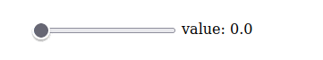
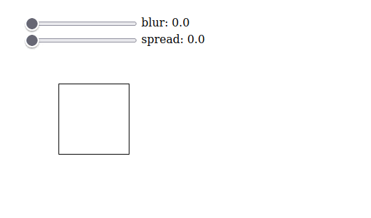
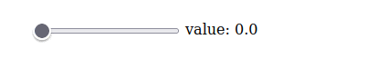
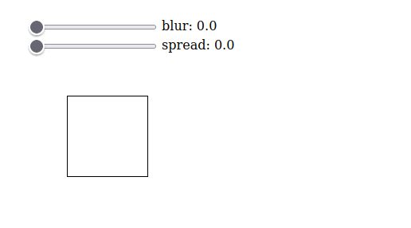

# Components

### Components & Composition

Deviating from its grand-predecessor Elm, Mation embraces component-based architecture. However, Mation agress with Elm that components should not be *objects*, ie, have isolated state. Additionally, Mation agrees that the popular conception (ala React, Vue) gives a little too much power to components.

A component in Mation consists of four things:

- A *model type* and *initial model*
- A *view*
- An optional *daemon*

Sound familiar? You've already seen components! A "component" is the same thing as an "application", just smaller.

The only thing that "makes a component a component", so to speak, is when you embed it within a larger component. This is done with a nifty tool called `enroot`:

```haskell
Mation.Elems.enroot :: forall s a. Setter' s a -> Html' a -> Html' s
```

If you've never seen the `Setter'` type before, think of it as a kind of generalized notion of a field. In `Setter' s a` the `s` type is some large "object" type and the `a` type is the type of some "field". So there's a value of type

```haskell
Setter' { size :: Int, label :: String } String
```

because the `{ size :: Int, label :: String }` type has a field of type `String`. There's also a value of type

```haskell
Setter' (String /\ Int /\ Char /\ Boolean) Char
```

because we can reasonably think of the 4-tuple type `String /\ Int /\ Char /\ Boolean` as having a "field" of type `Char`.

The `enroot` function allows us to turn an `Html' s` into an `Html' a` as long as we give it a `Setter' s a`—that is, as long as `a` is a "field" of `s`.

For example, let's create a slider component.

```haskell
import Prelude

import Mation.Elems as E
import Mation.Props as P
import Data.Number as Number

type SliderModel = Number  -- Value of the slider

initialSlider :: SliderModel
initialSlider = 0.0

renderSlider :: String -> SliderModel -> E.Html' SliderModel
renderSlider label value =
  E.div
  []
  [ E.input
    [ P.type_ "range"
    , P.value (show value)
    , P.onInputValue \newValueString apply ->
        case Number.fromString newValueString of
          Nothing -> pure unit
          Just newValue -> apply (\_oldValue -> newValue)
    , P.addCss "vertical-align: middle"
    ]
  , E.text " "
  , E.text label
  , E.text (": " <> show value)
  ]
```

The signature of `renderSlider` is `String -> SliderModel -> Html' SliderModel`. This has an extra parameter as compared to what we've seen before, which have been render functions of the type `Model -> Html' Model` (for some `Model`). When this component is embedded within a parent component, this extra parameter will be supplied by the parent.

```haskell
import Mation.Run (runApp)

main :: Effect Unit
main =
  runApp
    { render: renderSlider "value"
    , initial: initialSlider
    , daemon: mempty
    , root: underBody
    }
```



Nice, that's definitely a slider.

Now we create a "box shadow generator" component into which this slider component will be embedded. The box shadow generator presents the user with two slider inputs, one which decides a `blur` value and one which decides a `spread` value. These values are then rendered to a `<div>` with a `box-shadow` set.

We must give this parent component a model type and view. Its model is `{ blur :: Number, spread :: Number }`, since that's what it needs to track. Its view renders the actual `box-shadow`.

```haskell
import Type.Proxy (Proxy (..))
import Data.Foldable (intercalate)
import Mation.Lenses (field)
import Mation.Styles as S

type BoxShadowModel = { blur :: Number, spread :: Number }

initialBoxShadow :: BoxShadowModel
initialBoxShadow = { blur: initialSlider, spread: initialSlider }

renderBoxShadow :: BoxShadowModel -> E.Html' BoxShadowModel
renderBoxShadow model =
  E.div
  []
  [ E.enroot _blur $ renderSlider "blur" model.blur
  , E.enroot _spread $ renderSlider "spread" model.spread
  , E.div
    [ P.addStyles
      [ S.display "inline-block"
      , S.width "100px"
      , S.height "100px"
      , S.marginTop "50px"
      , S.marginLeft "50px"
      , S.border "1px solid black"
      , S.boxShadow $ intercalate " "
            [ "0px"
            , "0px"
            , show model.blur <> "px"
            , show model.spread <> "px"
            , "rgba(0,0,0,0.35)"
            ]
      ]
    ]
    []
  ]

  where

  _blur = field (Proxy :: Proxy "blur")
  _spread = field (Proxy :: Proxy "spread")
```



Please excuse the compression artifacts from my use of `.gif`.

This component uses `P.addStyles` and `Mation.Styles`, which we haven't seen before, but hopefully are pretty intuitive.

More interesting is the use of `E.enroot`, `field`, and `Proxy`. If you'll allow me to simplify, the `field` function, in conjunction with `Proxy`, creates first-class fields (ie, `Setter'`s) for record types. In our case our record type is `BoxShadowModel` and the two fields we create are `blur` and `spread`. We have

```haskell
_blur   :: Setter' BoxShadowModel Number
_spread :: Setter' BoxShadowModel Number
```

When used with `E.enroot`, we get:

```haskell
E.enroot _blur   :: Html' Number -> Html' BoxShadowModel
E.enroot _spread :: Html' Number -> Html' BoxShadowModel
```

Thinking of the `Setter'`s `_blur` and `_spread` as acting to pick out fields of the record type `BoxShadowModel`, the values `enroot _blur` and `enroot _spread` are able to take some `Html'` that wants to act on a `Number` model and make it act on a `BoxShadowModel` instead, performing any actions on the `BoxShadowModel`'s `.blur` and `.spread` fields.

As a reminder, a value of type `Html' Number` is some HTML whose event handlers want to update a model of type `Number`. Passing such a value into `enroot _blur` modifies its event listeners to instead update the `.blur` field of a `BoxShadowModel`.

So that's it! Embedding a Mation component inside of another essentially consists of three steps:

1. Ensure that the parent component model contains* the child component model
2. Set the parent component `initial` value to use the child component `initial` value
3. Use `enroot` to nestle the child component view within the parent component view

There's an astericks after "contains" in (1). This is because the notion of "containment" given by `Setter'`s is extremely flexible, moreso than one might expect. Talking about it in detail is a little out of scope for an introductory guide, though.


### Composing Daemons

Regarding components, one large leaf has been left unturned, which is the possibility that our child component has a daemon. What to do then?

Say, for instance, we want our sliders to slowly creep down to zero over time (this is a bit strange, but indulge me). We can achieve this with a daemon:

```haskell
import Mation.Core.Util.WRef (WRef)
import Mation.Core.Util.WRef as WRef

sliderDaemon :: WRef SliderModel -> Effect Unit
sliderDaemon wref = do
  setInterval 500.0 do
    currentValue <- WRef.read wref
    let newValue = if currentValue <= 0.0 then currentValue else currentValue - 1.0
    wref # WRef.write newValue

foreign import setInterval
  :: Number -> Effect Unit -> Effect Unit
  -- Same as before
```



In the above `.gif`, it's the slider component which I've got wired up to `runApp`. We want to run the box shadow component instead, but then the `sliderDaemon` is ignored. What to do?

The answer is to use

```haskell
Mation.Core.Daemon.enroot :: forall s. Lens' s a -> WRef a -> WRef s
```

Like `Mation.Elems.enroot`, the purpose of this `enroot` is to embed: in this case, one daemon within another. It accepts a `Lens' s a` (which is a more specific kind of `Setter' s a`) and uses that to transform a `WRef s`—a reference to some "small" type—into a `WRef a`—a reference to some "lage" type.

In our case we have `_blur :: Lens' BoxShadowModel SliderModel`. Note that `_blur` is *both* a `Lens'` *and* a `Setter'`; this is because `Lens'` and `Setter'` are in a subtyping relationship. This gives us

```haskell
enroot _blur :: WRef SliderModel -> WRef BoxShadowModel
```

Now by using `enroot _blur` and `enroot _spread` we can create a daemon for our box shadow model which simply executes the daemons for the sliders:

```haskell
import Mation.Core.Daeon as D

boxShadowDaemon :: WRef BoxShadoeModel -> Effect Unit
boxShadowDaemon wref = do
  D.enroot _blur sliderDaemon wref
  D.enroot _spread sliderDaemon wref
  where
    _blur = field (Proxy :: Proxy "blur")
    _spread = field (Proxy :: Proxy "spread")
```




### Inner Decouplings

As mentioned, a component consists of several parts: a *model type* and *initial model*, a *view*, and an optional *daemon*. Unlike most component-based frameworks, Mation chooses *not* to ever bundle these up: there is no `Component` type. (This trait is shared by Mation's predecessor Shpadoinkle)

This can be strange and a little uncomfortable at times, as one is unable to point to any single thing and say, look, this is my component! (The closest you can get is to have roughly one component per purescript module; this often works great.)

However, the lack of a `Component` type is intentional. It was experimented with, and found to *greatly* inhibit the flexibility of components. The preference of the framework is for flexibility and simplicity over clarity.

