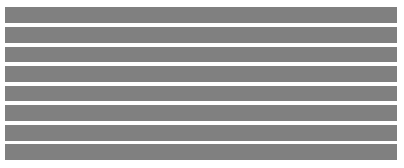
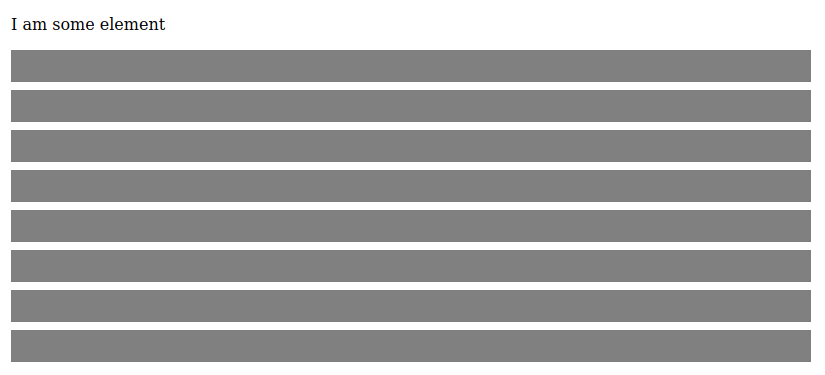

## Styling & Monoidal HTML

At this point you have enough information to start writing Mation apps. Before you do, though, I want to introduce the built-in styling API and give a little tip which can help a ton with writing `Html'` values.

Firstly, the styling API. Mostly this is simple enough: the module `Mation.Styles` contains one export per CSS rule name, such as

```haskell
Mation.Styles.background :: String -> Style
```

which can be used with `Mation.Props.addStyles` like

```haskell
import Prelude
import Effect (Effect)

import Mation (Html')
import Mation.Run (runApp, underBody)
import Mation.Styles as S
import Mation.Props as P
import Mation.Elems as E

html :: Html' Unit
html =
  E.div
  [ P.addStyles
    [ S.background "linear-gradient(to right, blue, red)"
    , S.height "2em"
    ]
  ]
  []

main :: Effect Unit
main = runApp
  { initial: unit
  , render: \_ -> html
  , daemon: mempty
  , root: underBody
  }
```

This gives:


I'll take a moment to note that the styling API is entirely string-based; this is for the sake of simplicity.

One very nice feature of the styling system is support for selectors. We may amend the above `html` to only show color on hover by using `S.on` and `Mation.Selectors.hover`:

```haskell
import Mation.Selectors as Sel

html :: Html' Unit
html =
  E.div
  [ P.addStyles
    [ S.background "grey"
    , S.on Sel.hover
      [ S.background "linear-gradient(to right, blue, red)"
      ]
    , S.height "2em"
    ]
  ]
  []
```


Selectors are not limited to things like `:hover` or `:active`. Pretty much all of the CSS selector API is supported, including child and media queries. Mostly this is done with the `#>>` operator, which combines two selectors, so

```haskell
Sel.children Sel.#>> Sel.hover
```

corresponds to the CSS selector `> :hover`. Mation additionally has a selector called `#<>` which can be read as "both", as in "both this and that". The selector `a #<> b` selects both what `a` selects and what `b` selects.

For instance, we can have multiple elements and have each, on hover, style itself and its neighbor:

```haskell
import Mation.Selectors ((#>>), (#<>))

html :: Html' Unit
html =
  E.div
  [ P.addStyles
    [ S.on (Sel.children #>> Sel.hover #>> (Sel.this #<> Sel.next "*"))
      [ S.background "linear-gradient(to right, blue, red)"
      ]
    ]
  ]
  (
    Array.range 1 8 # map \_ ->
      E.div
      [ P.addStyles
        [ S.background "grey"
        , S.height "2em"
        , S.marginBottom ".5em"
        ]
      ]
      [ ]
  )
```



Let's take a moment to unravel the complex selector

```haskell
Sel.children #>> Sel.hover #>> (Sel.this #<> Sel.next "*")
```

Starting from the inside, we have `this` and `next "*"`. The `this` selector selects the current element (ie, whatever is already been selected)—it "does nothing". The `next "*"` selector corresponds to CSS `+ *`—that is, select the next element. Together `this #<> next "*"` mean "select me and the following element".

This composite selector is chained together with `children`, which corresponds to CSS `> *`, and `hover`, which corresponds to CSS `:hover`. Altogether the selectors correspond to

```css
> *:hover, > *:hover ~ *
```

Pretty neat, I think!

Alright, one more thing. In the previous example we had to build the children elements as an array, which we did using `Array.range` and `map`. This works fine, but can quickly become annoying when we want to do something even slightly complex. For instance, if we want an element before all of our `<div>`s, we have to do it like this:

```haskell
html :: Html' Unit
html =
  E.div
  [ P.addStyles
    [ S.on (Sel.children #>> Sel.hover #>> (Sel.this #<> Sel.next "*"))
      [ S.background "linear-gradient(to right, blue, red)"
      ]
    ]
  ]
  (
    [ E.p
      []
      [ E.text "I am some element" ]
    ]
    <>
    Array.range 1 8 # map \_ ->
      E.div
      [ P.addStyles
        [ S.background "grey"
        , S.height "2em"
        , S.marginBottom ".5em"
        ]
      ]
      [ ]
  )
```

Not exactly ideal. There's a better way! Inheriting from its predecessor `purescript-elmish`, Mation's `Html'` type instantiates `Monoid`. This means that you can use `mempty` to get an empty `Html'` value, and you can use `<>` to juxtapose two HTML values. More pertinently, it means one can use `foldMap` to perform "loops" within `Html'` generation. Take a look at this:

```haskell
import Data.Foldable (foldMap)

html :: Html' Unit
html =
  E.div
  [ P.addStyles
    [ S.on (Sel.children #>> Sel.hover #>> (Sel.this #<> Sel.next "*"))
      [ S.background "linear-gradient(to right, blue, red)"
      ]
    ]
  ]
  [ E.p
    []
    [ E.text "I am some element" ]
  , Array.range 1 8 # foldMap \_ ->
      E.div
      [ P.addStyles
        [ S.background "grey"
        , S.height "2em"
        , S.marginBottom ".5em"
        ]
      ]
      [ ]
  ]
```



We can likewise use `Data.Monoid.guard :: Monoid m => Boolean -> m -> m` to place "if statements" within `Html'` generation code, all without having to break out of the convenient nested-array syntax. This can turn out to be extremely handy when writing real-world `Html'`!
