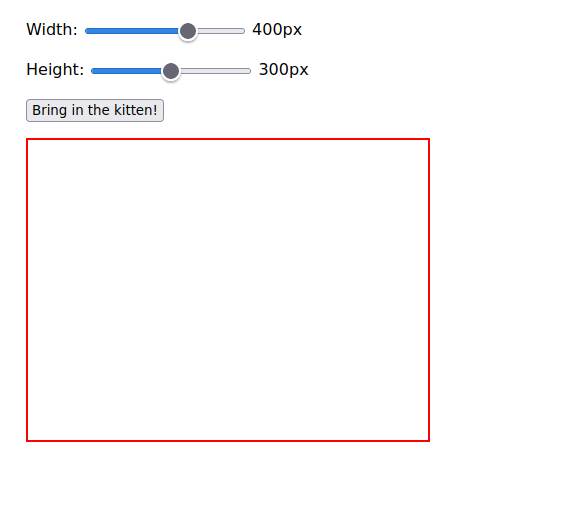

## More samples

Note: if you have nix, you can mess with these yourself.

- clone the repo & enter it
- run `nix develop` then `mation.devt`. this will serve to `localhost:8000`
- edit some files in `samples/`!

- `samples/Counter.purs`

  

- `samples/Async.purs`

  

- `samples/Clock.purs`

  

- `samples/Kittens.purs`

  

